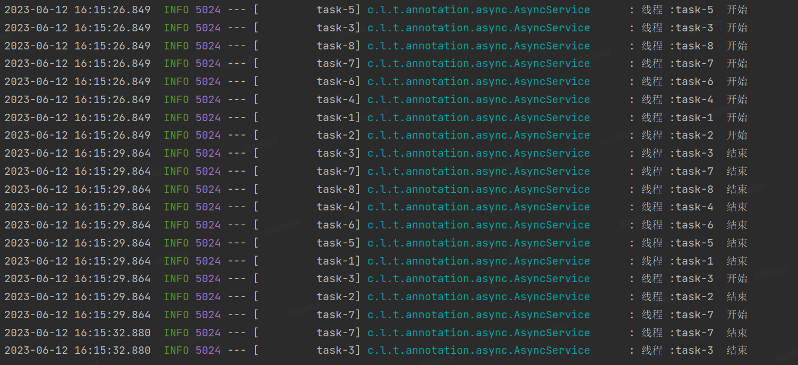
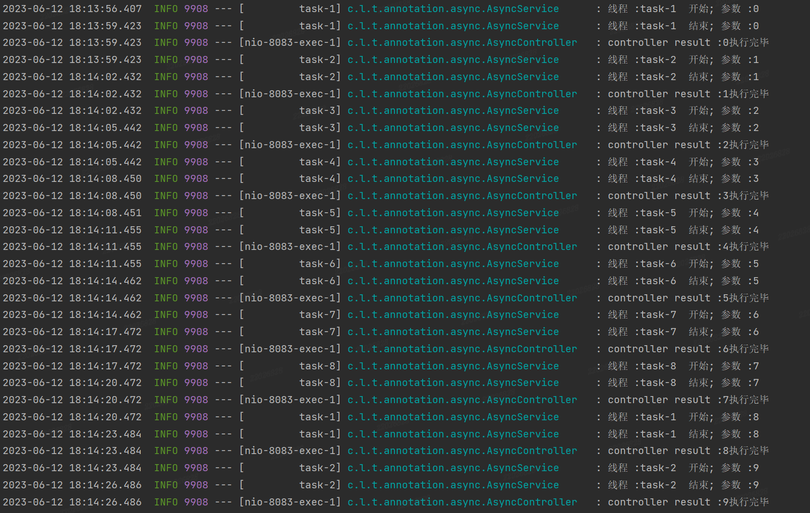
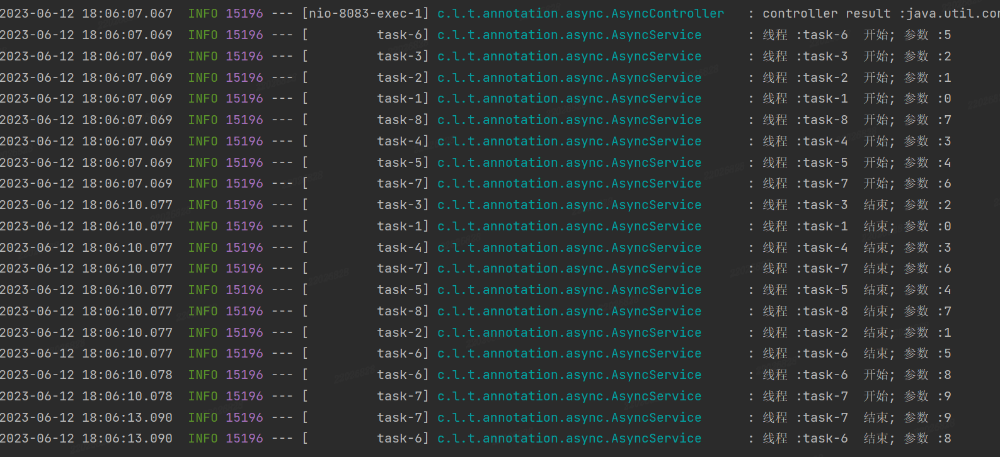
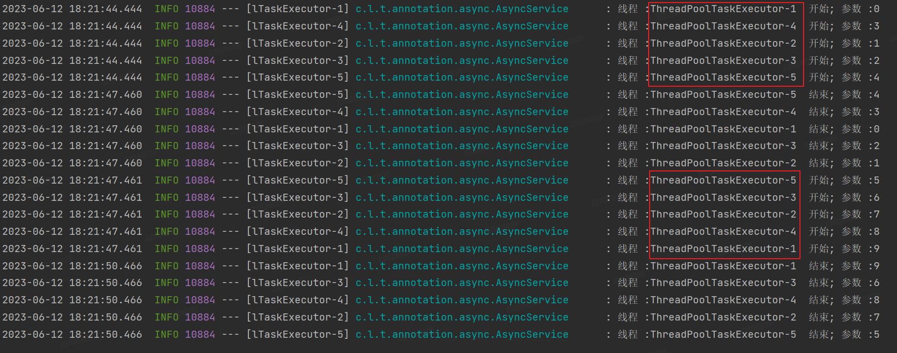

## @Async

[toc]

#### 一、简介

@Async顾名思义，异步处理。将复杂或耗时长的业务可以进行梳理归纳分为多线程去执行，@Async在使用上会更简单一些。

@Async的默认线程池为**SimpleAsyncTaskExecutor**。

---

#### 二、基础使用

该注解是spring3提供的，所以只需要引入`spring-context` 和 `spring-boot-starter-aop` 即可。

只需要在类上添加@EnableAsync注解，在方法上添加@Async注解即可，核心代码如下：

~~~java
package com.lzhch.thread.annotation.async;

import lombok.extern.slf4j.Slf4j;
import org.springframework.scheduling.annotation.Async;
import org.springframework.scheduling.annotation.EnableAsync;
import org.springframework.stereotype.Service;

import java.util.concurrent.CompletableFuture;
import java.util.concurrent.Future;

/**
 * 

 * author: lzhch
 * version: v1.0
 * date: 2023/6/12 15:33
 */

@Slf4j
@EnableAsync // 在调用异步方法的类上添加该注解, 不是在启动类上
@Service(value = "iAsyncService")
public class AsyncService {

    /**
     * 没有返回值的异步调用
     * 

     * Author: lzhch 2023/6/12 18:07
     */
    @Async
    public void asyncMethod() {
        try {
            String name = Thread.currentThread().getName();
            log.info("线程 :{}  开始", name);
            Thread.sleep(3000);
            log.info("线程 :{}  结束", name);
        } catch (InterruptedException e) {
            throw new RuntimeException(e);
        }
    }

    /**
     * 需要返回值的异步调用
     *
     * @param param param
     * @return CompletableFuture<String>
     * Author: lzhch 2023/6/12 17:03
     */
    @Async
    public CompletableFuture<String> asyncParamMethod(String param) {
        try {
            String name = Thread.currentThread().getName();
            log.info("线程 :{}  开始; 参数 :{}", name, param);
            Thread.sleep(3000);
            log.info("线程 :{}  结束; 参数 :{}", name, param);

            // 直接使用 CompletableFuture 来处理异步的结果, 比Future更加灵活
            return CompletableFuture.completedFuture(param + "执行完毕");
        } catch (InterruptedException e) {
            throw new RuntimeException(e);
        }
    }

}
~~~

测试类代码：

~~~java
package com.lzhch.thread.annotation.async;

import lombok.extern.slf4j.Slf4j;
import org.springframework.web.bind.annotation.GetMapping;
import org.springframework.web.bind.annotation.RequestMapping;
import org.springframework.web.bind.annotation.RestController;

import javax.annotation.Resource;
import java.util.concurrent.CompletableFuture;
import java.util.concurrent.ExecutionException;

/**
 * 

 * author: lzhch
 * version: v1.0
 * date: 2023/6/12 15:56
 */

@Slf4j
@RestController
@RequestMapping(value = "async")
public class AsyncController {

    @Resource
    private AsyncService asyncService;

    @GetMapping(value = "asyncMethod")
    public void asyncMethod() {
        for (int i = 0; i < 10; i++) {
            this.asyncService.asyncMethod();
        }
    }

    @GetMapping(value = "asyncParamMethod")
    public void asyncParamMethod() throws ExecutionException, InterruptedException {
        for (int i = 0; i < 10; i++) {
            CompletableFuture<String> result = this.asyncService.asyncParamMethod(String.valueOf(i));
            // get 方法会造成阻塞, 它会等待异步操作完成并返回结果, 相当于同步执行
            // log.info("controller result :{}", result.get());
            // thenApply()、thenAccept() 或 thenRun() 为异步方法
            log.info("controller result :{}", result.thenApplyAsync(item-> item));
        }
    }

}
~~~

因为@Async是基于AOP切面进行的，所以要注意避免切面失效。

网上发现该注解还会引起循环依赖，需要注意业务的分层和代码解耦。

没有返回值执行日志：

有返回值get阻塞请求执行日志:

有返回值异步非阻塞执行日志:

---

#### 三、自定义线程池

spring提供的默认的线程池为**SimpleAsyncTaskExecutor**。

CompletableFuture默认的线程池为**ForkJoinPool.commonPool()**。

两者均不太满足正常项目的使用，所以使用自定义线程池**ThreadPoolTaskExecutor**。

只需要实现AsyncConfigurer接口并重写相关方法即可进行自定义配置。

~~~java
package com.lzhch.thread.annotation.async.config;

import org.springframework.context.annotation.Configuration;
import org.springframework.scheduling.annotation.AsyncConfigurer;
import org.springframework.scheduling.concurrent.ThreadPoolTaskExecutor;

import java.util.concurrent.Executor;

/**
 * 自定义线程池
 * 

 * author: lzhch
 * version: v1.0
 * date: 2023/6/12 18:18
 */

@Configuration
public class AsyncConfig implements AsyncConfigurer {

    @Override
    public Executor getAsyncExecutor() {
        // 自定义线程池配置
        ThreadPoolTaskExecutor executor = new ThreadPoolTaskExecutor();
        executor.setCorePoolSize(5);
        executor.setMaxPoolSize(10);
        executor.setQueueCapacity(25);
        executor.initialize();
        return executor;
    }

}
~~~

执行日志：

通过日志可以发现，线程池替换成功，并且设置核心线程为5也成功。

---

#### 其他

可补充不同线程池的区别，以及ThreadPoolTaskExecutor的优点。

