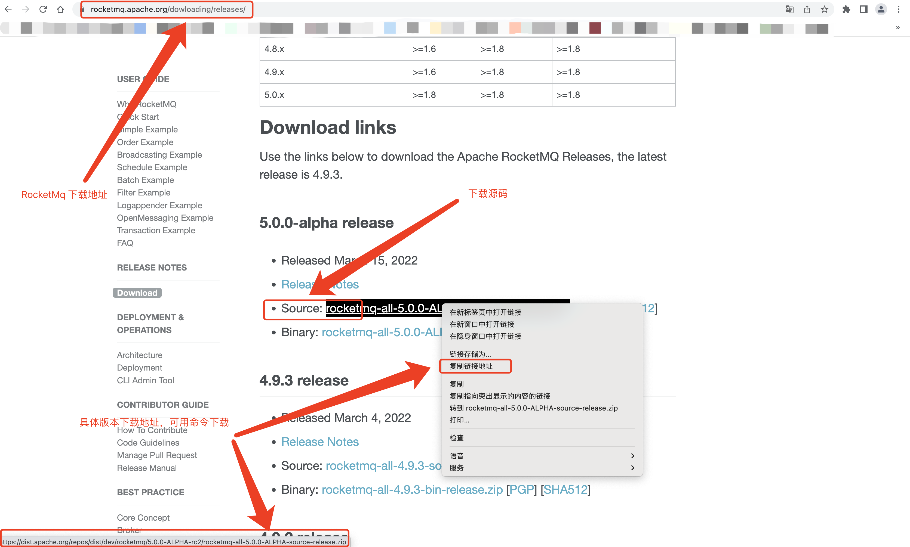
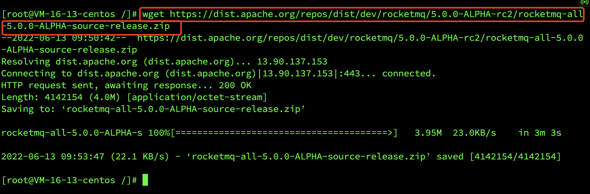
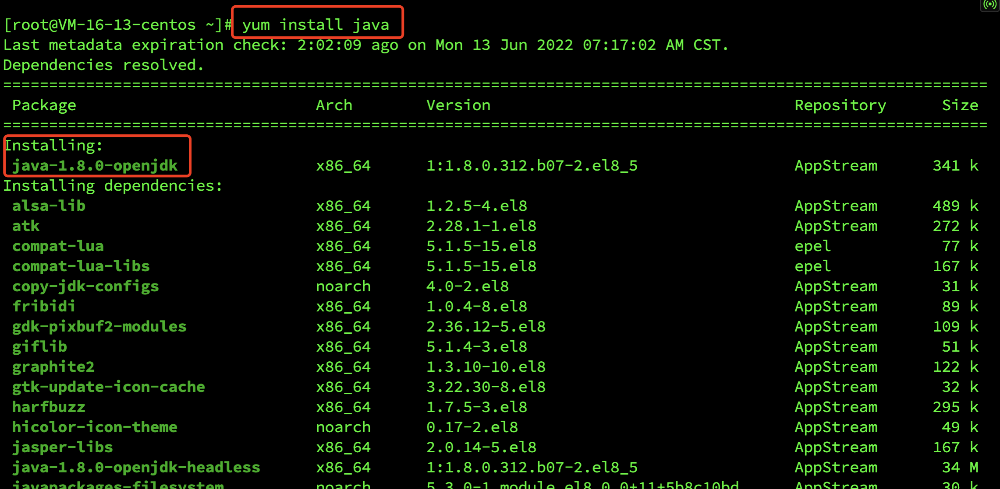
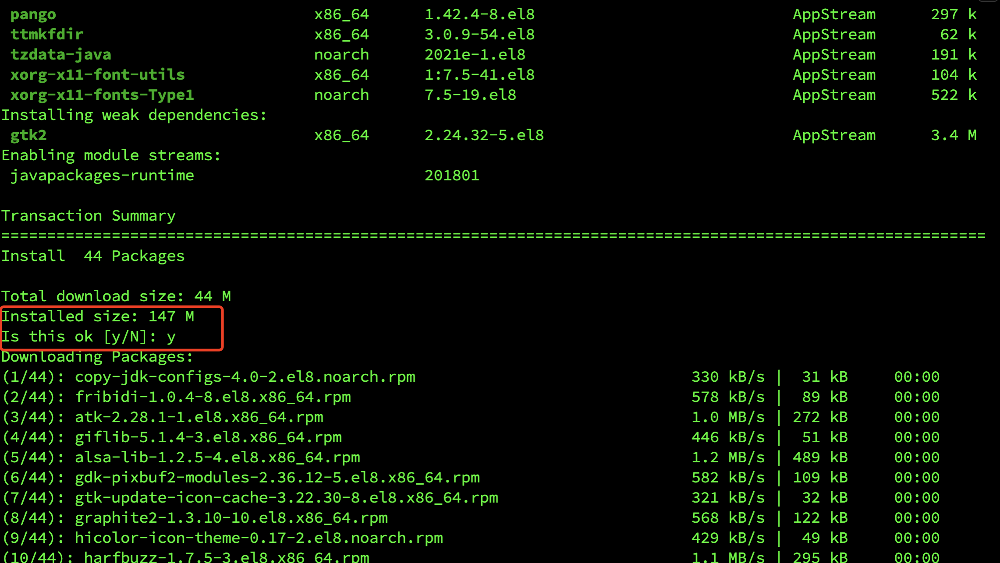
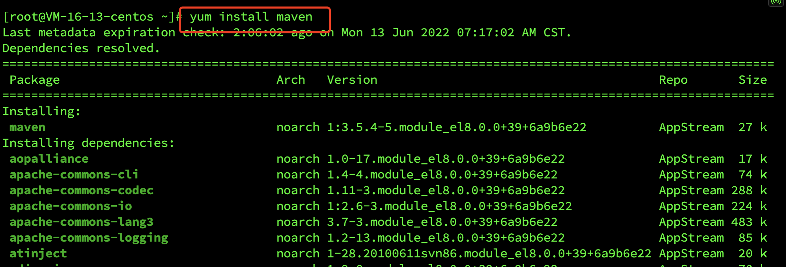
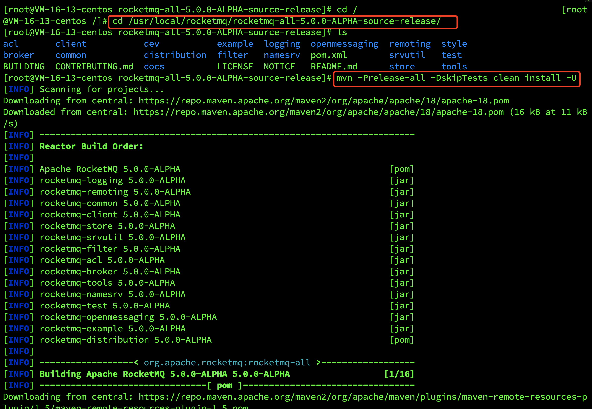
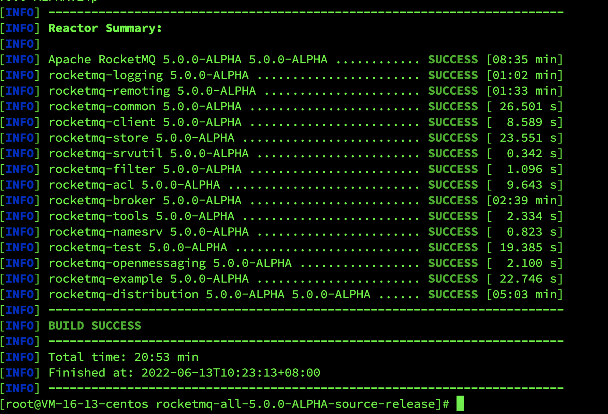
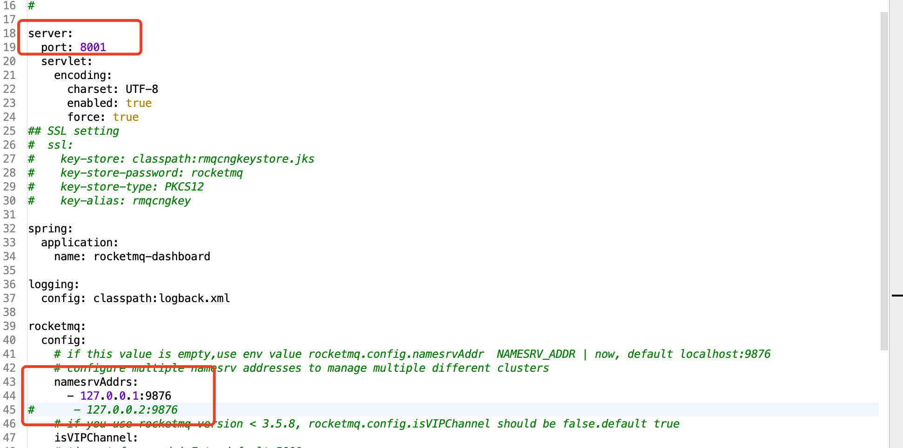

## CentOS 8.0 搭建 RocketMq

[toc]

#### 一、 搭建 RocketMq 服务

##### 1. 下载 RocketMq

方式一：

> https://rocketmq.apache.org/dowloading/releases/
>
> 打开页面去下载相应版本的二进制的压缩包，将压缩包上传到服务器

方式二：

> wget https://dist.apache.org/repos/dist/dev/rocketmq/5.0.0-ALPHA-rc2/rocketmq-all-5.0.0-ALPHA-source-release.zip

> 通过 wget 命令下载压缩包，下载地址和方式一的地址一致

---

##### 2. 安装 java 和 maven 环境

查询可安装 java 版本

> yum list java*

安装 java， 这里安装默认的

> yum install java[或者是上面查询出的某个]

查看可安装的 maven 版本

> yum list maven*

安装 maven，这里默认

> yum install maven
>

校验安装是否成功：

> Java -version
>
> mvn -version

---

##### 3. 解压编译

1. 如果没有安装 unzip ，先执行命令安装：

> yum install -y unzip zip

2. 新建 `usr/local/rocketmq`	目录

> cd /
>
> mkdir -p /usr/local/rocketmq

3. 进入 MQ 压缩包所在目录进行解压，解压到 `usr/local/rocketmq`

> cd /root
>
> unzip rocketmq-all-5.0.0-ALPHA-source-release.zip -d /usr/local/rocketmq/

4. 进入 MQ 解压之后的目录下进行编译打包，该操作时间较长

> cd /usr/local/rocketmq/rocketmq-all-5.0.0-ALPHA-source-release/
>
> mvn -Prelease-all -DskipTests clean install -U

编译成功如下：

5. 将打包内容移动到 `/usr/local/rocketmq` 

>  mv /usr/local/rocketmq/rocketmq-all-5.0.0-ALPHA-source-release/distribution/target/rocketmq-5.0.0-ALPHA/rocketmq-5.0.0-ALPHA/* /usr/local/rocketmq/

该操作非必须，只是为了方便操作，以下是基于移动之后进行记录的。

---

##### 4. 启动

**以下操作均基于编译打包之后的 bin 目录下进行。**

如果进行了 3.5 操作【移动打包内容】则 bin 目录：/usr/local/rocketmq/bin；

如果没进行 3.5 操作【移动打包内容】则 bin 目录：/usr/local/rocketmq/rocketmq-all-5.0.0-ALPHA-source-release/distribution/target/rocketmq-5.0.0-ALPHA/rocketmq-5.0.0-ALPHA/bin

1. ###### 修改启动参数

> 修改目录 `bin` 下的 3 个配置文件： `runserver.sh、runbroker.sh 、tools.sh`不然会报 insufficient memory

- 设置 `runserver.sh` 中此项配置

~~~java
	JAVA_OPT="${JAVA_OPT} -server -Xms256m -Xmx256m -Xmn512m -XX:MetaspaceSize=128m -XX:MaxMetaspaceSize=320m"
~~~

- 设置 `runbroker.sh` 中此项配置

~~~java
	JAVA_OPT="${JAVA_OPT} -server -Xms256m -Xmx256m -Xmn128m"
~~~

- 设置 `tools.sh` 中此项配置

~~~java
	JAVA_OPT="${JAVA_OPT} -server -Xms256m -Xmx256m -Xmn256m -XX:PermSize=128m -XX:MaxPermSize=128m"
~~~

2. ###### 修改 broker 配置

> 到跟上面 bin 目录同级的 config 目录下修改 broker.conf 文件

增加 **brokerIP1 = 公网 IP** ，配置 broker IP 为公网 IP，否则默认内网 IP，程序无法进行连接。

2. ###### 运行 nameserver

创建日志存放路径（此步骤在根目录下执行）

> mkdir /usr/local/rocketmq/logs
>
> cd /usr/local/rocketmq/logs/
>
> touch namesrv.log
>
> touch broker.log

运行 nameserver

> 到 bin 目录下执行
>
> nohup sh mqnamesrv  > /usr/local/rocketmq/logs/namesrv.log 2>&1 &

停止运行 nameserver

> sh mqshutdown namesrv

4. ###### 运行 broker

> 到 bin 目录下执行
>
> nohup sh mqbroker -c /usr/local/rocketmq/rocketmq-all-5.0.0-ALPHA-source-release/distribution/target/rocketmq-5.0.0-ALPHA/rocketmq-5.0.0-ALPHA/conf/broker.conf -n 150.158.170.34:9876 > /usr/local/rocketmq/logs/broker.log 2>&1 &

停止运行 broker

> sh bin/mqshutdown broker

查看 broker 配置

> sh mqbroker -m

---

#### 二、 安装 RocketMq 控制台

##### 1. 下载安装包

> https://github.com/apache/rocketmq-dashboard

下载 zip 压缩包，上传到服务器 `/usr/local/rocketmq/dashboard`

---

##### 2. 解压

> cd /usr/local/rocketmq/dashboard
>
> unzip rocketmq-dashboard-master.zip

---

##### 3. 修改配置文件

> cd /usr/local/rocketmq/dashboard/rocketmq-dashboard-master/src/main/resources/

修改 `application.yml` ，修改端口和 nameserver

---

##### 4. 编译打包

> cd /usr/local/rocketmq/dashboard/rocketmq-dashboard-master/ 
>
> mvn clean package -Dmaven.test.skip=true

成功打包后，会在 `rocketmq-dashboard-master` 目录下生成 `target` 目录，`target` 下有 `rocketmq-dashboard-1.0.1-SNAPSHOT.jar` ，将 jar 包移动到 `dashboard` 下

> mv /usr/local/rocketmq/dashboard/rocketmq-dashboard-master/target/rocketmq-dashboard-1.0.1-SNAPSHOT.jar /usr/local/rocketmq/dashboard/

---

##### 5. 启动

> nohup java -jar -Xmx500M rocketmq-dashboard-1.0.1-SNAPSHOT.jar >/usr/local/rocketmq/logs/dashboard.log 2>&1 &

访问

> http://150.158.170.34:8001/

---

