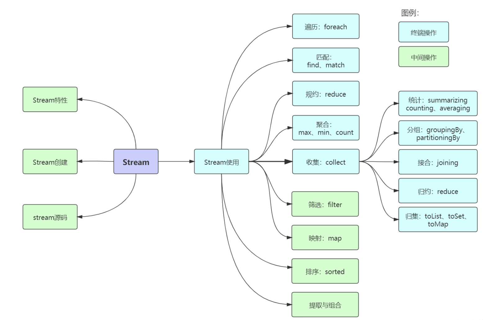
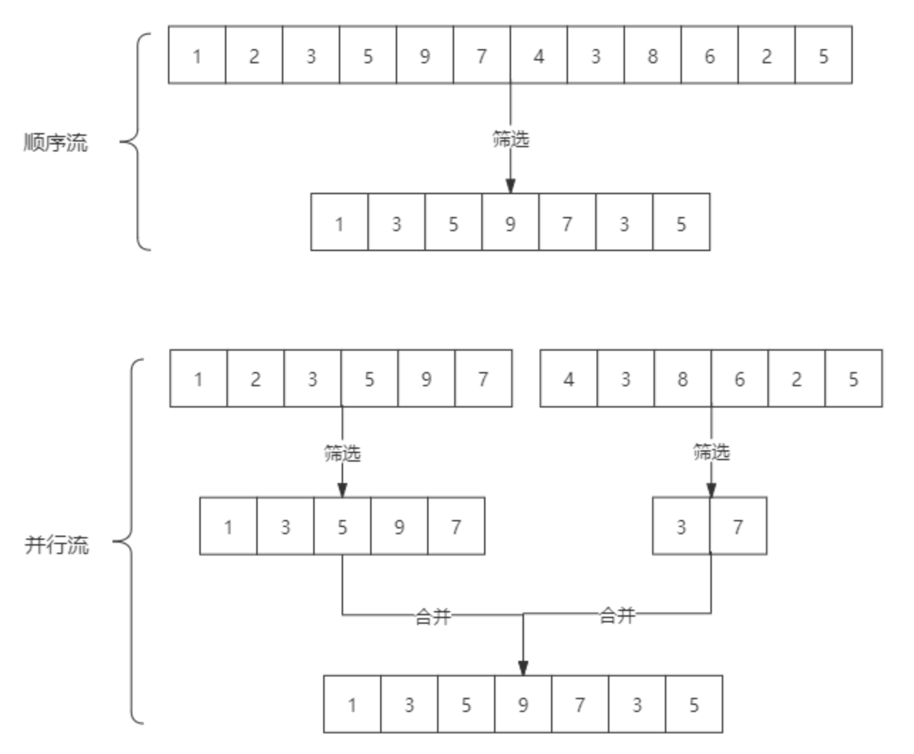
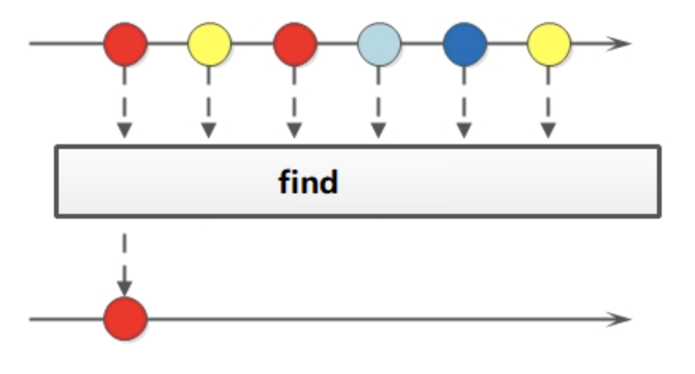
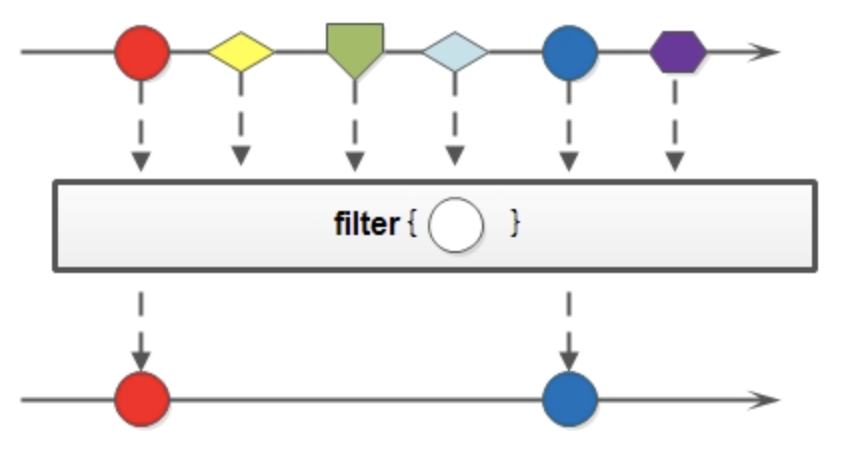
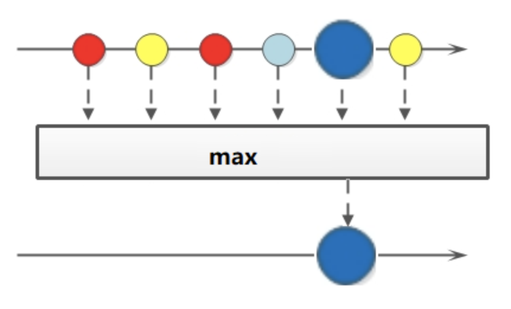
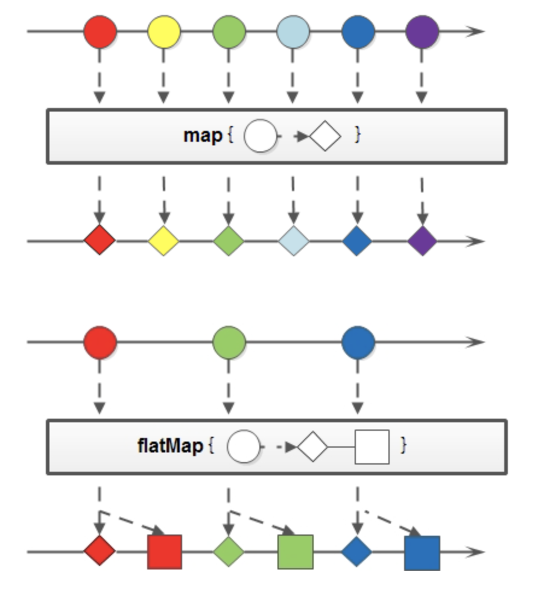
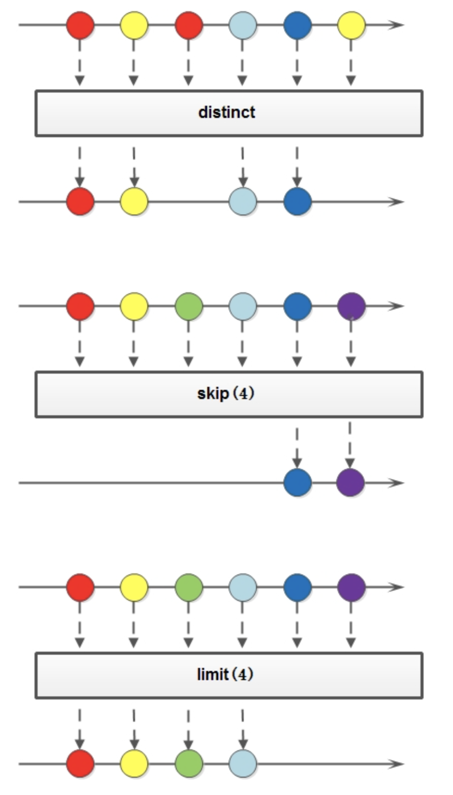

## Stream

[toc]



#### 一、 Stream 概述

> `Stream`将要处理的元素集合看作一种流，在流的过程中，借助`Stream API`对流中的元素进行操作，比如：筛选、排序、聚合等。

`Stream` 可以由数组或者集合创建，对流的操作分为两种:

1. 中间操作，每次返回一个新的流，可以有多个。
2. 终端操作，每个流只能进行一次终端操作，终端操作结束后流无法再次使用。终端操作会产生一个新的集合或者值。

`Stream`  的特性：

1. Stream 不存储数据，而是按照特定的规则对数据进行计算，一般会输出结果。
2. Stream 不会改变数据源，通常情况下会产生一个新的集合或一个值。
3. Stream 具有延迟执行特性，只有调用终端操作时，中间操作才会执行。

---

#### 二、 Stream 的创建

`Stream` 可以通过集合或者数组进行创建

##### 1. 通过 `java.util.Collection.stream()` 方法用集合创建流

~~~java
List<String> list = Arrays.asList("a", "b", "c");
// 创建一个顺序流
Stream<String> stream = list.stream();
// 创建一个并行流
Stream<String> parallelStream = list.parallelStream();
~~~

##### 2. 使用`java.util.Arrays.stream(T[] array)`方法用数组创建流

~~~java
int[] array={1,3,5,6,8};
IntStream stream = Arrays.stream(array);
~~~

##### 3. 使用`Stream`的静态方法：`of()、iterate()、generate()`

```java
Stream<Integer> stream = Stream.of(1, 2, 3, 4, 5, 6);

Stream<Integer> stream2 = Stream.iterate(0, (x) -> x + 3).limit(4);
stream2.forEach(System.out::println);

Stream<Double> stream3 = Stream.generate(Math::random).limit(3);
stream3.forEach(System.out::println);
```

输出结果：

> 0 3 6 9
> 0.6796156909271994
> 0.1914314208854283
> 0.8116932592396652

##### 4. 顺序流和并行流的简单区分

`Stream` 是顺序流，由主线程按顺序对流执行操作；

`parallelStream` 是并行流，内部以多线程并行执行的方式对流进行操作，但前提是流中的数据处理没有顺序要求。

例如筛选集合中的奇数，两者的处理不同之处：



由图可以看出，并行流类似于二分查找，如果流中的数据量足够大，并行流可以加快处理速度。

除了直接创建并行流，还可以通过 `parallel` 把顺序流转换成并行流：

~~~java
Optional<Integer> findFirst = list.stream().parallel().filter(x->x>6).findFirst();
~~~

---

#### 三、Stream 的使用

下面代码使用到的类：

~~~java
/**
 * @packageName： com.lzhch.stream.lambda.init
 * @className: Person
 * @description: 用户类
 * @version: v1.0
 * @author: lzhch
 * @date: 2021-12-01 16:15
 */
@Data
@AllArgsConstructor
@NoArgsConstructor
public class Person {

    private String name;

    private String sex;

    private int age;

    private int salary;

    private String address;

}
~~~

~~~java
/**
 * @packageName： com.lzhch.stream.lambda.init
 * @className: InitList
 * @description:  初始化列表
 * @version: v1.0
 * @author: lzhch
 * @date: 2021-12-01 16:14
 */
public class InitList {

    public static List<Person> initList() {
        List<Person> resList = new ArrayList<>();
        resList.add(new Person("xxx", "man", 20, 9, "address1"));
        resList.add(new Person("yyy", "man", 22, 10, "address2"));
        resList.add(new Person("zzz", "women", 40, 15, "address3"));
        resList.add(new Person("aaa", "women", 60, 6, "address4"));

        return resList;
    }

}
~~~


##### 1. 遍历、匹配（foreach、find、match）

`Stream` 也是支持类似集合的遍历和元素匹配的，只是 `Stream` 中的元素是以 `Optional` 类型存在的。



~~~java
		/**
     * foreach/ stream.foreach
     * foreach 循环的入参是一个 Consumer 类型, 是函数式接口
     * foreach 和 stream.foreach 的效果是一样的
     * foreach 循环更加适合用于简单逻辑的循环遍历(或修改), 不适合进行过多的复杂业务的处理
     */
    public void foreach() {
        List<Person> list = InitList.initList();
        System.out.println("========foreach=======");
        list.forEach(x -> System.out.println(x.toString()));

        System.out.println("========stream.foreach=======");
        list.stream().forEach(x -> System.out.println(x.toString()));

        System.out.println("========foreach complex=======");
        list.stream().forEach(x -> {
            if ("xxx".equals(x.getName())) {
                System.out.println(x.toString());
            }
        });

        list.stream().forEach(x -> x.setAge(10));
        System.out.println(list.toString());
    }
~~~

~~~java
    /**
     * find
     * findFirst 匹配第一个元素
     * findAny 匹配任意一个元素, 适合并行流, 也可以跟 filter 等搭配使用
     */
    public void find() {
        List<Person> list = InitList.initList();
        System.out.println("========find first=======");
        Optional<Person> first = list.stream().findFirst();
        Person person = list.stream().findFirst().orElse(null);
        System.out.println("first :{} " + first.get().toString());

        System.out.println("========find any=======");
        Optional<Person> any = list.parallelStream().findAny();
        System.out.println("any :{} " + any.get().toString());
        Optional<Person> anyFilter = list.parallelStream().filter(x -> x.getAge() > 20).findAny();
        System.out.println("any :{} " + anyFilter.get().toString());
    }
~~~

~~~java
    /**
     * match
     * 根据条件进行匹配 返回 boolean 类型
     * allMatch: list 的元素全部满足条件返回 true; 反之 返回 false
     * anyMatch: list 的元素任意一个满足条件返回 true; 反之 返回 false
     * noneMatch: list 的元素全部不满足条件返回 true; 反之 返回 false
     */
    public void match() {
        List<Person> list = InitList.initList();
        System.out.println("========all match=======");
        boolean allMatch = list.stream().allMatch(x -> x.getAge() > 40);
        System.out.println("allMatch :{} " + allMatch);

        System.out.println("========any match=======");
        boolean anyMatch = list.stream().anyMatch(x -> x.getAge() > 70);
        System.out.println("anyMatch :{} " + anyMatch);

        System.out.println("========none match=======");
        boolean noneMatch = list.stream().noneMatch(x -> x.getAge() > 50);
        System.out.println("noneMatch :{} " + noneMatch);
    }
~~~

##### 2. 筛选（filter）

筛选是按照一定的规则校验流中的元素，将符合条件的元素提取到新的流中的操作。



~~~java
    /**
     * stream.filter
     * filter 是将符合条件的元素过滤出来形成新的流 所以需要新的集合去接收返回值
     */
    public void filter() {
        List<Person> list = InitList.initList();
        System.out.println("========filter=======");
        List<Person> resList = list.stream().filter(x -> x.getAge() > 24).collect(Collectors.toList());
        System.out.println("old list :{} " + list.toString());
        System.out.println("resList :{} " + resList);

        System.out.println("========filter foreach======");
        list.stream().filter(x -> x.getAge() > 24).forEach(System.out::println);

        System.out.println("======== filter findFirst ========");
        Optional<Person> first = list.stream().filter(x -> x.getAge() > 30).findFirst();
        System.out.println("filter findFirst :{} " + first);

        System.out.println("======== filter findAny =======");
        Optional<Person> any = list.stream().filter(x -> x.getAge() > 30).findAny();
        System.out.println("findAny :{} " + any);
    }
~~~

##### 3. 聚合（max、min、count）



~~~java
    /**
     * 聚合（max/min/count)
     */
    public void aggregate() {
        List<Person> list = InitList.initList();
        System.out.println("======== max age ========");
        Optional<Person> max = list.stream().max(Comparator.comparingInt(Person::getAge));
        System.out.println("max :{} " + max.get());

        System.out.println("======== min age ========");
        Optional<Person> min = list.stream().min(Comparator.comparing(Person::getAge));
        System.out.println("min :{} " + min.get());

        System.out.println("======== count ========");
        long count = list.stream().filter(x -> x.getAge() > 20).count();
        System.out.println("count :{age > 20} " + count);
    }
~~~

##### 4. 映射（map/flatMap）

映射可以将一个流的元素按照一定的规则映射到另一个流中，分为 `map` 和 `flatMap`。 

- map： 接收一个函数作为参数，该函数会被应用到每个元素上，并将其映射成一个新的元素。
- flatMap： 接收一个函数作为参数，将流中的每个值都换成另一个流，然后把所有流连接成一个流。



~~~java
    /**
     * 映射(map/flatMap)
     * 映射, 可以将一个流的元素按照一定的映射规则映射到另一个流中
     * map: 接收一个有返回值的函数作为参数, 该函数会被应用到每个元素上, 并将其映射成一个新的元素
     * flatMap: 接收一个有返回值的函数作为参数, 将流中的每个值都换成另一个流, 然后把所有流连接成一个流
     */
    public void mapping() {
        List<Person> list = InitList.initList();

        // 会改变原有集合的值
        System.out.println("======== map 会改变原有集合的值 =======");
        System.out.println("original list :{} " + list.toString());
        // 新建一个 list 统一修改新的 list 的 address 字段为 '这是一个地址', 会修改原有的 list 的值 可以用原有的 list 去接收
        List<Person> newList = list.stream()
                .map(x -> {
                    x.setAge(10);
                    return x;
                })
                .collect(Collectors.toList());
        System.out.println("new list :{} " + newList.toString());

        // 不改变原有集合的值
        System.out.println("======== map 不改变原有集合的值 =======");
        list = InitList.initList();
        System.out.println("original list :{} " + list.toString());
        // 新建一个 list 统一修改新的 list 的 address 字段为 '这是一个地址', 不会修改原有的 list 的值 需要用新的 list 去接收
        List<Person> newList1 = list.stream()
                .map(x -> {
                    Person person = new Person();
                    BeanUtils.copyProperties(x, person);
                    person.setAddress("这是一个地址");
                    return person;
                })
                .collect(Collectors.toList());
        System.out.println("new list :{} " + newList1.toString());

        // map 可以返回不同类型的 list(可用于类型转换)
        System.out.println("======== map 返回不同类型的 list(可用于类型转换) =======");
        list = InitList.initList();
        System.out.println("original list :{} " + list.toString());
        // 将 list 中的 name 属性提取成一个单独的 list
        // List<String> newList3 = list.stream()
        //         .map(x -> {
        //             String person = x.getName();
        //             return person;
        //         })
        //         .collect(Collectors.toList());
        List<String> newList3 = list.stream()
                .map(Person::getName)
                .collect(Collectors.toList());
        System.out.println("new list :{} " + newList3.toString());

        System.out.println("======== 分组后拼接成字符串 =============");
        list = InitList.initList();
        System.out.println("original list :{} " + list.toString());
        String collect = list.stream().map(Person::getName).collect(Collectors.joining(","));
        System.out.println("new String :{} " + collect);

        System.out.println("======== flatMap =======");
        List<String> list1 = Arrays.asList("m-k-l-a", "1-3-5-7");
        List<String> listNew = list1.stream().flatMap(s -> {
            // 将每个元素转换成一个stream
            String[] split = s.split("-");
            Stream<String> s2 = Arrays.stream(split);
            return s2;
        }).collect(Collectors.toList());

        System.out.println("处理前的集合：" + list1);
        System.out.println("处理后的集合：" + listNew);
    }
~~~

##### 5. 归约（reduce）

归约也称缩减，是把一个流缩减成一个值，能实现对集合求和、求乘积和求最值操作。


~~~java
    /**
     *  归约(reduce)
     *      也称缩减, 顾名思义, 是把一个流缩减成一个值, 能实现对集合求和、求乘积和求最值操作
     */
    public void reduce() {
        List<Person> list = InitList.initList();
        System.out.println("======== reduce + ========");
        Optional<Integer> reduce = list.stream().map(x -> x.getAge()).reduce((x, y) -> x + y);
        Optional<Integer> reduce1 = list.stream().map(Person::getAge).reduce(Integer::sum);
        Integer reduce2 = list.stream().map(Person::getAge).reduce(0, Integer::sum);
        System.out.println("reduce :{} " + reduce.get());
        System.out.println("reduce1 :{} " + reduce1.get());
        System.out.println("reduce2 :{} " + reduce1.get());

        System.out.println("======== reduce * ========");
        Optional<Integer> reduce3 = list.stream().map(Person::getAge).reduce((x, y) -> x * y);
        System.out.println("reduce3 :{} " + reduce3.get());

        System.out.println("======== reduce max ========");
        Optional<Person> reduce4 = list.stream().reduce((x, y) -> x.getAge() > y.getAge() ? x : y);
        System.out.println("reduce4 :{} " + reduce4.get());
    }
~~~

##### 6. 收集-分组（collect-groupBy）

将一个 list 进行分组转换成多个 Map, 可以进行单级分组和多级分组

~~~java
   /**
     * 收集-分组 collect-groupBy
     *  将一个 list 进行分组转换成多个 Map, 可以进行单级分组和多级分组
     *  入参是 Function 接口
     */
    public void groupBy() {
        List<Person> list = InitList.initList();
        System.out.println("========== groupBy =============");
        System.out.println("=========== 根据单个属性分组 ============");
        Map<String, List<Person>> collect = list.stream().collect(Collectors.groupingBy(Person::getName));
        System.out.println("groupBy :{name} " + collect.toString());
        List<String> nameLength = list.stream().collect(Collectors.groupingBy(Person::getName)).keySet().stream().sorted(Comparator.comparing(String::length).reversed()).collect(Collectors.toList());
        System.out.println("max :{name.length} " + nameLength);

        System.out.println("=========== 根据多个属性拼接分组 ============");
        Map<String, List<Person>> collect1 = list.stream().collect(Collectors.groupingBy(x -> x.getName() + "-" + x.getAge()));
        System.out.println("groupBy :{name-age} " + collect1.toString());

        System.out.println("=========== 根据多条件分组 ============");
        Map<String, List<Person>> collect2 = list.stream().collect(Collectors.groupingBy(x -> {
                    if (x.getAge() > 30) {
                        return "age>30";
                    } else {
                        return "ageOther";
                    }
                }
        ));
        System.out.println("groupBy :{age>30} " + collect2.toString());

        System.out.println("=========== 按子组收集数据[求总数] ============");
        // 分别求男女性别的人数
        Map<String, Long> collect3 = list.stream().collect(Collectors.groupingBy(Person::getSex, Collectors.counting()));
        System.out.println("groupBy :{counting} " + collect3.toString());

        System.out.println("=========== 按子组收集数据[求和] ============");
        // 分别求男性的年龄和以及女性的年龄和
        Map<String, Integer> collect4 = list.stream().collect(Collectors.groupingBy(Person::getSex, Collectors.summingInt(Person::getAge)));
        System.out.println("groupBy :{summing} " + collect4.toString());

        System.out.println("=========== 按子组收集数据[平均值] ============");
        // 分别求男性的平均年龄和女性的平均年龄
        Map<String, Double> collect5 = list.stream().collect(Collectors.groupingBy(Person::getSex, Collectors.averagingInt(Person::getAge)));
        System.out.println("groupBy :{averaging} " + collect5.toString());

        System.out.println("=========== 按子组收集数据[求和/总数/平均值/极值等] ============");
        // Collectors.summarizingDouble();Collectors.summarizingLong(); 同理,只是数据类型不一样
        // 分别求男女性别的一些数值数据
        Map<String, IntSummaryStatistics> collect6 = list.stream().collect(Collectors.groupingBy(Person::getSex, Collectors.summarizingInt(Person::getAge)));
        System.out.println("groupBy :{summarizing} " + collect6.toString());

        System.out.println("========== 按子组收集数据[根据性别分组,每组只保留年龄最大的] =============");
        // 根据性别分组,每组只保留年龄最大的, 如果有年龄相同的默认保存第一个
        Map<String, Person> collect7 = list.stream().collect(Collectors.groupingBy(Person::getSex, Collectors.collectingAndThen(Collectors.maxBy(Comparator.comparing(Person::getAge)), Optional::get)));
        System.out.println("groupBy :{} " + collect7.toString());

        System.out.println("========== 联合其他收集器[根据性别分组,每组根据姓名分组,只保留姓名] ===========");
        Map<String, Set<String>> collect8 = list.stream().collect(Collectors.groupingBy(Person::getSex, Collectors.mapping(Person::getName, Collectors.toSet())));
        System.out.println("groupBy :{} " + collect8.toString());
    }
~~~

##### 7. 收集-分区（collect-partitioningBy）

将流按照一定条件转化为两个 Map (入参是 Predicate 接口, 只能根据 true 和 false 分为两组)

~~~java
    /**
     *  collect-partitioningBy 收集-分区
     *    将流按照一定条件转化为两个 Map (入参是 Predicate 接口, 只能根据 true 和 false 分为两组)
     */
    public void partitioningBy() {
        List<Person> list = InitList.initList();
        System.out.println("========== partitioningBy =============");
        Map<Boolean, List<Person>> collect = list.stream().collect(Collectors.partitioningBy(x -> x.getAge() > 40));
        System.out.println("partitioningBy :{} " + collect.toString());
    }
~~~

##### 8. 收集-归集（toList/toSet/toMap)

因为流不存储数据，那么在流中的数据处理完成后，需要将流中的数据重新归集到新的集合里。 `toList`、`toSet`和`toMap`比较常用，另外还有`toCollection`、`toConcurrentMap`等复杂一些的用法。

~~~java
    /**
     *  收集-归集（toList/toSet/toMap)
     *   因为流不存储数据，那么在流中的数据处理完成后，需要将流中的数据重新归集到新的集合里
     */
    public void otherCollections() {
        List<Person> list = InitList.initList();
        System.out.println("========== 转换为其他的集合形式 =============");
        System.out.println("========== toList(年龄大于 40 的人) =============");
        List<Person> collect = list.stream().filter(x -> x.getAge() > 40).collect(Collectors.toList());
        System.out.println("toList(年龄大于 40 的人) :{} " + collect.toString());

        System.out.println("========== toSet(取出所有人的性别) =============");
        Set<String> collect1 = list.stream().map(Person::getSex).collect(Collectors.toSet());
        System.out.println("toSet(取出所有人的性别) :{} " + collect1.toString());

        System.out.println("========== toMap(年龄大于 30 的按照姓名分组) =============");
        Map<String, Person> collect2 = list.stream().filter(x -> x.getAge() > 30).collect(Collectors.toMap(Person::getName, x -> x));
        System.out.println("toMap(年龄大于 30 的按照姓名分组) :{} " + collect2.toString());
    }
~~~

##### 9. 收集-统计(collect-count/averaging/maxBy/summing/summarizing)

Collectors提供了一系列用于数据统计的静态方法：

- 计数：count
- 平均值：averagingInt、averagingLong、averagingDouble
- 最值：maxBy、minBy
- 求和：summingInt、summingLong、summingDouble
- 统计以上所有：summarizingInt、summarizingLong、summarizingDouble

~~~java 
    /**
     *  收集-统计(count/averaging/maxBy/summing/summarizing)
     *  Collectors提供了一系列用于数据统计的静态方法：
     *      计数：count
     *      平均值：averagingInt、averagingLong、averagingDouble
     *      最值：maxBy、minBy
     *      求和：summingInt、summingLong、summingDouble
     *      统计以上所有：summarizingInt、summarizingLong、summarizingDouble
     */
    public void statistical() {
        List<Person> list = InitList.initList();
        System.out.println("========== Collectors 提供的用于数据统计的静态方法 =============");
        System.out.println("========== 求总数[年龄大于 40 的人数] ==========");
        Long collect = list.stream().filter(x -> x.getAge() > 40).collect(Collectors.counting());
        System.out.println("求总数[年龄大于 40 的人数] :{} " + collect.toString());

        System.out.println("========== 求平均数[年龄大于 30 的人的平均工资] ==========");
        // averagingInt、averagingLong 同理
        Double collect1 = list.stream().filter(x -> x.getAge() > 30).collect(Collectors.averagingDouble(Person::getSalary));
        System.out.println("求平均数[年龄大于 30 的人的平均工资] :{} " + collect1.toString());

        System.out.println("========== 求最值[求最高工资] ==========");
        // minBy 同理
        Optional<Integer> collect2 = list.stream().map(Person::getSalary).collect(Collectors.maxBy(Integer::compare));
        System.out.println("求最值[求最高工资] :{} " + collect2.get());

        System.out.println("========== 求和[求年龄和] ==========");
        // summingLong、summingDouble 同理
        Integer collect3 = list.stream().collect(Collectors.summingInt(Person::getAge));
        System.out.println("求和[求年龄和] :{} " + collect3.toString());

        System.out.println("========== 求以上所有信息[总数/平均/最值/和] ==========");
        DoubleSummaryStatistics collect4 = list.stream().collect(Collectors.summarizingDouble(Person::getSalary));
        System.out.println("求工资的总数/平均/最值/和] :{} " + collect4.toString());
    }
~~~

##### 10. 收集-结合（collect-joining）

`joining` 可以将 Stream 中的元素用特定的连接符连接成一个字符串，没有指定连接符则直接连接。

~~~java
    /**
     *  接合(joining)
     *   joining 可以将 Stream 中的元素用特定的连接符连接成一个字符串，没有指定连接符则直接连接。
     */
    public void joining() {
        List<Person> list = InitList.initList();
        System.out.println("======== joining ===========");
        System.out.println("======== 将所有的人的姓名按照,组成一个新的字符串");
        String collect = list.stream().map(Person::getName).collect(Collectors.joining(","));
        System.out.println("result :{} " + collect.toString());
    }
~~~

##### 11. 收集-规约（collect-reduce）

`Collectors` 类提供的 `reducing` 方法，相比于 `stream` 本身的 `reduce` 方法，增加了对自定义规约的支持。

~~~java
   /**
     *  集合-规约(collect-reduce)
     *   Collectors 类提供的 reducing 方法，相比于 stream 本身的 reduce 方法，增加了对自定义规约的支持。
     */
    public void collectReduce() {
        List<Person> list = InitList.initList();
        System.out.println("======== collect-reduce[计算虚岁年龄和] ===========");
        // 从 0 开始计算虚岁年龄和, 循环中每个年龄元素+1
        Integer collect = list.stream().collect(Collectors.reducing(0, Person::getAge, (x, y) -> x + y + 1));
        System.out.println("result :{} " + collect.toString());
    }
~~~

##### 11. 排序（sorted）

Sorted 是中间操作，有两种排序：

- sorted()：自然排序，流中元素需实现Comparable接口
- sorted(Comparator com)：Comparator排序器自定义排序

~~~java
    /**
     * sorted 排序
     *  sorted 是中间操作，有两种排序：
     *      1. sorted()：自然排序，流中元素需实现Comparable接口
     *      2. sorted(Comparator com)：Comparator排序器自定义排序
     */
    public void sorted() {
        List<Person> list = InitList.initList();
        System.out.println("========== sorted =============");
        System.out.println("=========== 单个条件排序(根据年龄倒序排序) ==============");
        List<Person> list1 = list.stream().sorted(Comparator.comparing(Person::getAge).reversed()).collect(Collectors.toList());
        System.out.println("sorted :{} " + list1.toString());

        System.out.println("=========== 多条件排序(根据年龄降序并根据工资升序) ================");
        List<Person> list2 = list.stream().sorted(Comparator.comparing(Person::getAge).reversed().thenComparing(Person::getSalary)).collect(Collectors.toList());
        System.out.println("sorted :{} " + list2.toString());

        System.out.println("=========== 多条件排序(根据年龄降序并根据工资降序) ================");
        List<Person> list3 = list.stream().sorted(Comparator.comparing(Person::getAge).reversed()).sorted(Comparator.comparing(Person::getSalary).reversed()).collect(Collectors.toList());
        System.out.println("sorted :{} " + list3.toString());

        System.out.println("=========== 多条件排序(根据年龄降序并根据工资降序2) ================");
        List<Person> list4 = list.stream().sorted((x, y) -> {
            if (x.getAge() == y.getAge()) {
                // return > 0 升序; return < 0 降序
                return y.getSalary() - x.getSalary();
            } else {
                return y.getAge() - x.getAge();
            }
        }).collect(Collectors.toList());
        System.out.println("sorted :{} " + list4.toString());
    }
~~~

##### 12. 提取、组合（concat/distinct/limit/skip）

流也可以进行合并、去重、限制、跳过等操作。



~~~java
    /**
     *  提取、组合（concat/distinct/limit/skip）
     */
    public void other() {
        List<Person> list = InitList.initList();
        System.out.println("======== concat[合并两个流] =========");
        List<Person> list1 = InitList.initList();
        List<Person> collect = Stream.concat(list.stream(), list1.stream()).collect(Collectors.toList());
        System.out.println("concat :{} " + collect.toString());

        System.out.println("======== distinct[去重] ==========");
        List<Person> collect1 = Stream.concat(list.stream(), list1.stream()).distinct().collect(Collectors.toList());
        System.out.println("distinct :{} " + collect1.toString());

        System.out.println("======== limit[限制从流中获得前n个数据] ==========");
        List<Person> collect2 = list.stream().limit(2).collect(Collectors.toList());
        System.out.println("limit :{} " + collect2.toString());
        System.out.println("======== limit[获取年龄最大的两个人] ==========");
        List<Person> collect3 = list.stream().sorted(Comparator.comparing(Person::getAge).reversed()).limit(2).collect(Collectors.toList());
        System.out.println("result :{} " + collect3.toString());


        System.out.println("======== skip[跳过前n个数据] ==========");
        List<Person> collect4 = list.stream().skip(1).collect(Collectors.toList());
        System.out.println("skip :{} " + collect4.toString());
        System.out.println("======== skip[跳过工资最低的一个人] ==========");
        List<Person> collect5 = list.stream().sorted(Comparator.comparing(Person::getSalary)).skip(1).collect(Collectors.toList());
        System.out.println("result :{} " + collect5.toString());
    }
~~~

---

#### 四、 项目地址

> https://github.com/Liuuzhichao/Personal-Practice/tree/master/Stream-Lambda